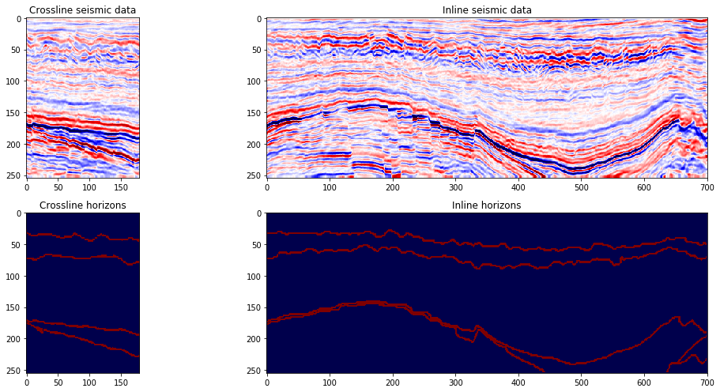
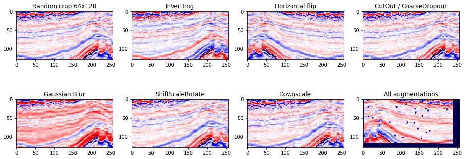

# H-Net
Fully convolutional network for seismic horizon detection.


---
## Problem statement
Seismic horizons are the borders between two rock layers with different physical properties. The task is to find these horizons all over the seismic cube and perform the binary segmentation: *does this pixel is horizon or not*.

Currently, the task of finding seismic horizons is solved by classical computer vision methods, which require preliminary marking of __each new seismic cube__ and __often break on a complex underground relief__.

In this work, we introduce a new approach to this task using deep learning methods.

---
## Dataset
For training and validating we will use [Netherlands F3 dataset](https://github.com/olivesgatech/facies_classification_benchmark) containing the seismic cube and marked seismic facies. Seismic facies is the rock bodies between two seismic horizons, so we can easily perform transformation between facies and horizons. 


Since the seismic cube is 3D data we can get two types of vertical sections along two axes. In seismic exploration, they are called inlines and crosslines. This is a very useful property that allows you to get more training examples. Below is an example of crossline and inline.



We performed train and validation split and get following shapes of data sets. It is important to note that we dropped from original dataset those inlines that we considered corrupted.
| Data split       | Num of Inlines           | Num of Crosslines  | Size percentage |
| ------------- |:-------------:| -----:|-----:|
| All | 581 | 701 | 100% |
| Train      | 401 | 701 | 69% |
| Validation      | 180     |   701 | 21% |

---
## Dataset preparation and augmentations.
In this section we describe data preparation and in particular data augmentations.

In each classification task, there is a problem of class imbalance. And in our case, this problem is most acute: seismic horizons occupy a very small part of the sections of the seismic cube. The solution to the problem may be the correct selection of the thickness of the horizon. We can well make the horizon more than one pixel in thickness, because the marking of the horizon occurs with strong assumptions. Expanding the boundary, we also increase the likelihood that a seismic horizon is actually located in the marked area. The best experimental thickness is 3 and 5.

Let's see the class distribution.
| Class       | Percentage if thickness is 1| Percentage if thickness is 3| Percentage if thickness is 5|
| :-------------: |:-------------:| :-------------:|:-------------:|
| Empty | 97.9% | 95.9% | 94.1% |
| Horizon      | 2.1% | 4.1% | 5.9% |

Data augmentation helps to train models with better generalization, which is extremely beneficial to us because of the very limited dataset for training. During augmentation, sections of the seismic cube were interpreted as grayscale images. However, unlike the standard tasks of computer vision, we must choose augmentations very carefully, focusing on a different nature of the data. For training we chose the following augmentations:



All these augmentations was chosen by following our ideas about data. Seismic data is wave reflection data, and seismic horizons are the most clearly reflected waves. As we know, waves have two phases, which in our image are in the intervals from 0 to 0.5 and from 0.5 to 1. The sharpness of wave reflection in each phase can be estimated as the L1 distance to 0 or 1, respectively. 

This is what underlies the seismic color map.


This information allows us to understand which augmentations can be applied to seismic data and which cannot. Perhaps the most important augmentation is the color inversion since it allows the neural network to learn the horizon color invariance. Seismic data is invariant to horizontal flipping, so choosing this augmentation was clear enough. Gaussian blur is also a very important augmentation, which removes unnecessary reflections and leaves only the clearest ones. All remaining augmentations are applied for reasons of better generalization of the model.

---

## Metric and loss function
Since horizon detection is the binary segmentation problem we will use metrics and loss functions applied to segmentation. It is worth remembering that our task is faced with the problem of class imbalance, which also affects the choice of loss functions. Good choice for imbalanced classification (binary segmentation is a classification problem) is Dice and Jaccard (also known as Intersection over Union) metrics and loss functions. Also, we will use binary cross-entropy loss as well.

Finally, the loss function for our task will be defined as:
```
loss = alpha * Weighted_binary_cross_entropy(weight_1, weight_2) + beta * JaccardLoss + gamma * DiceLoss
```
Where alpha, beta, gamma, weight_1 and weight_2 are hyperparameters.

And our main metric will be Intersection over Union.


## Model and training
In this work we use U-Net architecture with one input channel and one output channel.

---
## Reproducibility
```
pip install -r requirements.txt
python download.py
python train.py --config config.txt
python inference.py --config config.txt --path data/valid/
streamlit run explore.py
```
